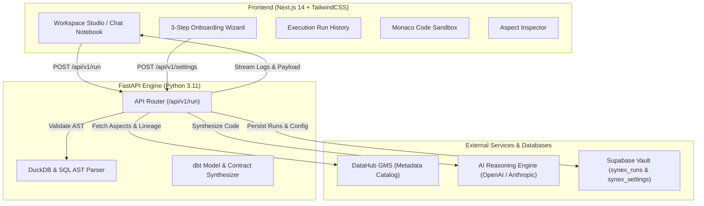

# ⚡ Synex — Autonomous AI Data Engineering Agent

> **DataHub Hackathon Submission** | Built by **Daniel** & **Precious**  
> **License:** [Apache 2.0](LICENSE)

Synex is a metadata-driven autonomous AI Data Engineering Agent powered by DataHub. It bridges your data warehouse context graph with LLM reasoning engines to automatically synthesize production-ready dbt SQL models, `schema.yml` data contracts, and column lineage while enforcing PII compliance and data quality rules.

---

## 🌟 Key Features

- **Conversational AI Memory:** Uses session-based state persistence (`session_id`) to carry previous SQL code models across multiple prompt turns, allowing incremental modifications and iterations within the same workspace studio thread.
- **Metadata-Driven Synthesis:** Queries DataHub GMS (`/aspects`) to discover table schemas, column data types, ownership tags, and upstream dependencies before generating code.
- **Interactive Workspace Studio:** Real-time Chat Notebook UI featuring live trace logs, Monaco code editor with `Commit Model` capabilities, and reactive ReactFlow lineage graphs.
- **PII Compliance Guardrails:** Automatically detects Tier-1 PII columns (e.g. `ssn`, `email`, `credit_card`) from DataHub tags and injects hashing/masking logic into synthesized SQL models.
- **3-Step Onboarding Wizard:** Full-screen initial setup flow guiding users through DataHub GMS configuration, Snowflake warehouse connection, and AI provider key verification.
- **Persistent Telemetry & Run History:** Stores execution history, session ids, synthesized SQL, and execution metrics in Supabase (`synex_runs`, `synex_settings`), featuring real-time search, status filtering, and one-click CSV exporting.
- **60fps Canvas Radial Loader:** 1.8s HTML5 canvas loader rendering 8 radiating graph rays that simulate real-time lineage node expansion.

---

## 🏗️ System Architecture



---

## 🛠️ Technology Stack

| Layer | Technologies |
| :--- | :--- |
| **Frontend UI** | Next.js 14 (App Router), TypeScript, TailwindCSS, ReactFlow, Monaco Editor, Lucide Icons |
| **State Management** | Zustand |
| **Backend Engine** | Python 3.11, FastAPI, Uvicorn, Pydantic |
| **Validation & AST** | DuckDB, SQLGlot |
| **Metadata Graph** | DataHub GMS (Generalized Metadata Service) |
| **Persistence & Audit** | Supabase (PostgreSQL, Row Level Security) |
| **AI Providers** | OpenAI (GPT-4o), Anthropic (Claude 3.5 Sonnet), Local (Ollama) |

---

## 🚀 Quickstart & Local Setup

### 1. Prerequisites
- Node.js 18+ and `npm`
- Python 3.10+ and `pip`
- Active Supabase project (or local PostgreSQL)

### 2. Database Preparation
To initialize session-based memory support, add the `session_id` column to the `synex_runs` table:
```sql
ALTER TABLE public.synex_runs ADD COLUMN session_id uuid;
```

### 3. Backend Setup
```bash
# Navigate to backend directory
cd backend

# Create virtual environment
python -m venv venv
source venv/bin/activate  # On Windows: venv\Scripts\activate

# Install dependencies
pip install -r requirements.txt

# Start FastAPI Uvicorn Server
python -m uvicorn app.main:app --port 8000 --reload
```

### 4. Frontend Setup
```bash
# Navigate to frontend directory
cd frontend

# Install dependencies
npm install

# Start Next.js development server
npm run dev
```

Open [http://localhost:3000](http://localhost:3000) in your browser.

---

## ⚙️ Environment Variables

Create `.env` inside `backend/`:

```env
SUPABASE_URL=https://yinkhotwycggmpghhkpe.supabase.co
SUPABASE_SERVICE_ROLE_KEY=your_supabase_service_role_key
DATAHUB_GMS_URL=http://localhost:8080
OPENAI_API_KEY=your_openai_api_key
```

---

## 🔒 Security & Honesty

- **API Keys via Environment Variables:** LLM and Supabase keys are stored as server-side environment variables on Render. They are never exposed to the browser or committed to Git.
- **Metadata Change Proposal (MCP) Write-back:** Synex uses the `acryl-datahub` Python SDK to emit `MetadataChangeProposalWrapper` objects back to DataHub GMS — this is a real DataHub graph write-back, not a mock. Note: this is distinct from the Model Context Protocol (MCP) server standard.
- **PII Enforcement:** PII detection runs server-side from DataHub tags and column name patterns before any SQL is generated. The LLM receives already-flagged columns and is instructed to mask them.

---

## 📄 License

Distributed under the **Apache License 2.0**. See [`LICENSE`](LICENSE) for more information.

---

<p center>
  Built with ❤️ for the <strong>DataHub Hackathon</strong> by <strong>Daniel</strong> & <strong>Precious</strong>.
</p>
